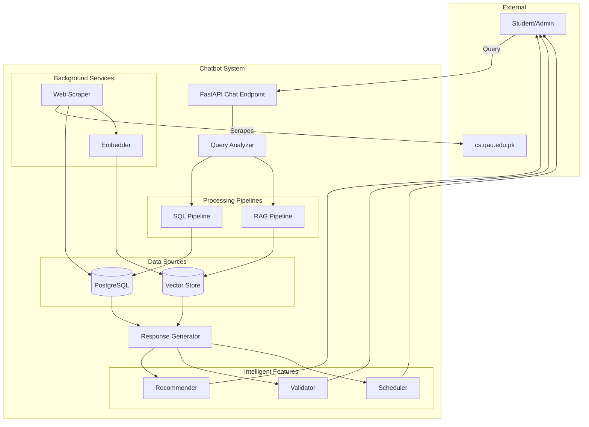

# Design Document: Chatbot Intelligence Upgrade

## Overview

This design specifies a comprehensive upgrade to the QAU CS Academic Advisor chatbot system, enhancing it from a database-driven query system to an intelligent multi-source conversational assistant. The upgrade adds web scraping capabilities, hybrid RAG (Retrieval-Augmented Generation) pipeline, intelligent features (recommendations, validation, conflict detection), and expanded domain coverage (faculty, research, news, events).

### Design Principles

1. **Backward Compatibility**: All existing APIs, database schemas, and functionality remain operational
2. **Performance First**: Maintain sub-second response times through caching, indexing, and async processing
3. **Accuracy Priority**: Verified sources prioritized; confidence thresholds prevent incorrect answers
4. **Incremental Enhancement**: Existing `backend/app/api/chat.py` enhanced, not replaced
5. **Modular Architecture**: New capabilities added as independent modules with clear interfaces

### Current System Architecture

The existing system follows this flow:
```
User Query → FastAPI → analyze_query() → _safe_answer() → Database Query → Response
```

Key components:
- **FastAPI Router**: `/chat` endpoint in `backend/app/api/chat.py`
- **Query Analyzer**: `app/nlp/service.py` (intent classification, entity extraction, language detection)
- **Response Generator**: `_safe_answer()` function with intent-based routing
- **PostgreSQL Database**: Structured data (courses, programs, timetables, policies)
- **Multi-Language**: English, Roman Urdu, Urdu script support

### Enhanced System Architecture

The upgraded system adds parallel processing pipelines:
```
                           ┌─────────────────┐
                           │  User Query     │
                           └────────┬────────┘
                                    │
                           ┌────────▼────────┐
                           │  Query Analyzer │
                           │  (Enhanced)     │
                           └────┬──────┬─────┘
                                │      │
                   ┌────────────┘      └─────────────┐
                   │                                  │
          ┌────────▼────────┐              ┌────────▼────────┐
          │  Structured     │              │   Unstructured  │
          │  Data Pipeline  │              │   Data Pipeline │
          │  (SQL)          │              │   (RAG)         │
          └────────┬────────┘              └────────┬────────┘
                   │                                  │
          ┌────────▼────────┐              ┌────────▼────────┐
          │  Database       │              │  Vector Store   │
          │  - Courses      │              │  - Faculty Bios │
          │  - Programs     │              │  - Research     │
          │  - Timetables   │              │  - News/Events  │
          │  - Policies     │              │  - Documents    │
          └────────┬────────┘              └────────┬────────┘
                   │                                  │
                   └────────────┬───────────────────┘
                                │
                       ┌────────▼────────┐
                       │  Response       │
                       │  Aggregator     │
                       └────────┬────────┘
                                │
                       ┌────────▼────────┐
                       │  Intelligent    │
                       │  Features       │
                       │  - Validate     │
                       │  - Recommend    │
                       │  - Detect       │
                       └────────┬────────┘
                                │
                       ┌────────▼────────┐
                       │  Formatted      │
                       │  Response       │
                       └─────────────────┘
```

## Architecture

### System Context Diagram



### Component Architecture

#### 1. Web Scraping Architecture

**Component**: `backend/app/scraper/`

**Structure**:
```
backend/app/scraper/
├── __init__.py
├── engine.py          # Main scraper orchestrator
├── parsers/
│   ├── __init__.py
│   ├── base.py        # Abstract parser interface
│   ├── faculty.py     # Faculty page parser
│   ├── course.py      # Course page parser
│   ├── news.py        # News page parser
│   ├── event.py       # Event page parser
│   └── policy.py      # Policy document parser
├── storage.py         # Database storage layer
├── config.py          # Parser configuration (CSS selectors, XPath)
└── scheduler.py       # Cron scheduling
```

**Data Flow**:
```
cs.qau.edu.pk → HTTP Fetch → HTML Parser → Checksum Check → 
  Changed? → Parser (CSS/XPath) → Structured Data → 
  Storage Layer → PostgreSQL + source_records
```

**Key Classes**:

```python
# engine.py
class ScraperEngine:
    """Orchestrates web scraping with incremental updates"""
    
    async def run_scrape(self, urls: list[str]) -> ScrapeResult:
        """Execute scraping for given URLs"""
        pass
    
    async def _fetch_page(self, url: str) -> tuple[str, str]:
        """Fetch page content and compute checksum"""
        pass
    
    async def _should_process(self, url: str, checksum: str) -> bool:
        """Check if content changed since last scrape"""
        pass

# parsers/base.py
class BaseParser(ABC):
    """Abstract parser with configuration-driven extraction"""
    
    @abstractmethod
    def parse(self, html: str, url: str) -> dict:
        """Extract structured data from HTML"""
        pass
    
    def _extract_by_selector(self, html: str, selector: str) -> str:
        """Apply CSS selector or XPath"""
        pass

# storage.py
class ScraperStorage:
    """Database storage with source tracking"""
    
    async def store_faculty(self, data: dict, source_id: UUID) -> UUID:
        """Store faculty member with source reference"""
        pass
    
    async def update_source_record(
        self, url: str, checksum: str, category: str
    ) -> UUID:
        """Create/update source_records entry"""
        pass
```

**Configuration** (YAML):
```yaml
# backend/app/scraper/config/selectors.yaml
faculty:
  name: "h1.faculty-name"
  title: "span.faculty-title"
  email: "a[href^='mailto:']"
  phone: "span.phone"
  office: "span.office-location"
  research_interests: "div.research-interests"
  
course:
  code: "span.course-code"
  title: "h2.course-title"
  description: "div.course-description"
  credits: "span.credits"
  
news:
  title: "h2.news-title"
  date: "time.publish-date"
  content: "div.news-content"
  
events:
  title: "h3.event-title"
  date: "time.event-date"
  time: "span.event-time"
  location: "span.event-location"
  description: "div.event-description"
```

#### 2. Enhanced RAG Pipeline

**Component**: `backend/app/rag/` (enhanced)

**Hybrid Search Strategy**:
```
User Query
    ├─→ Keyword Search (SQL LIKE, ts_vector)
    │     └─→ Courses, Programs, Timetables, Policies
    │
    └─→ Semantic Search (Vector Similarity)
          └─→ Document Chunks, Faculty Bios, News, Events
          
Results Merging:
    Score = 0.6 × keyword_score + 0.4 × semantic_score
    Boost verified sources: score × 1.3
    Sort by: score DESC, effective_from DESC
```

**Enhanced Components**:

```python
# backend/app/rag/hybrid_search.py
class HybridSearchEngine:
    """Combines keyword and semantic search"""
    
    def __init__(self, db: Session, vector_store: VectorStore):
        self.db = db
        self.vector_store = vector_store
        self.keyword_weight = 0.6
        self.semantic_weight = 0.4
    
    async def search(
        self, 
        query: str, 
        filters: dict = None,
        top_k: int = 10
    ) -> list[SearchResult]:
        """Execute hybrid search and merge results"""
        
        # Parallel execution
        keyword_results, semantic_results = await asyncio.gather(
            self._keyword_search(query, filters),
            self._semantic_search(query, filters)
        )
        
        # Merge and score
        merged = self._merge_results(keyword_results, semantic_results)
        
        # Apply verification boost
        for result in merged:
            if result.verification_status == 'verified':
                result.score *= 1.3
        
        # Sort and return top-k
        merged.sort(key=lambda x: (x.score, x.effective_from), reverse=True)
        return merged[:top_k]
    
    async def _keyword_search(
        self, query: str, filters: dict
    ) -> list[KeywordResult]:
        """SQL-based keyword search with ts_vector"""
        pass
    
    async def _semantic_search(
        self, query: str, filters: dict
    ) -> list[SemanticResult]:
        """Vector similarity search"""
        pass
    
    def _merge_results(
        self, 
        keyword: list[KeywordResult],
        semantic: list[SemanticResult]
    ) -> list[SearchResult]:
        """Combine results with weighted scoring"""
        pass

# backend/app/rag/embedder.py
class EnhancedEmbedder:
    """Generate embeddings for new content types"""
    
    async def embed_faculty(self, faculty: FacultyMember) -> np.ndarray:
        """Concatenate title + research_interests and embed"""
        text = f"{faculty.title}. {faculty.research_interests}"
        return await self.embed_text(text)
    
    async def embed_news(self, article: NewsArticle) -> np.ndarray:
        """Concatenate title + content and embed"""
        text = f"{article.title}. {article.content}"
        return await self.embed_text(text)
    
    async def embed_document_chunk(self, chunk: str) -> np.ndarray:
        """Embed document chunk with dimensionality 384"""
        pass

# backend/app/rag/context_expander.py
class ContextExpander:
    """Retrieve surrounding chunks for continuity"""
    
    def expand_chunks(
        self, 
        chunks: list[DocumentChunk],
        window_size: int = 2
    ) -> list[DocumentChunk]:
        """Fetch window_size chunks before/after each result"""
        pass
```

**Search Result Structure**:
```python
@dataclass
class SearchResult:
    """Unified search result"""
    content: str
    source_id: UUID
    source_code: str
    source_title: str
    source_url: str | None
    verification_status: str
    effective_from: date | None
    score: float
    result_type: str  # 'keyword' | 'semantic' | 'hybrid'
    metadata: dict
```

#### 3. Intelligent Features

**Component**: `backend/app/intelligence/`

**Structure**:
```
backend/app/intelligence/
├── __init__.py
├── recommender.py     # Course recommendations
├── validator.py       # Prerequisite validation
├── scheduler.py       # Conflict detection
└── explanations.py    # Recommendation rationales
```

**A. Recommendation Engine**:

```python
# backend/app/intelligence/recommender.py
class RecommendationEngine:
    """Personalized course suggestions"""
    
    def __init__(self, db: Session):
        self.db = db
    
    async def recommend_courses(
        self, 
        student_id: UUID,
        limit: int = 5
    ) -> list[CourseRecommendation]:
        """Generate personalized recommendations"""
        
        # Fetch student context
        profile = await self._get_student_profile(student_id)
        history = await self._get_course_history(student_id)
        
        # Get eligible courses
        candidates = await self._get_eligible_courses(
            curriculum_id=profile.curriculum_id,
            current_semester=profile.current_semester,
            completed_courses=history.completed
        )
        
        # Score candidates
        scored = []
        for course in candidates:
            score = self._compute_recommendation_score(
                course, profile, history
            )
            rationale = self._generate_rationale(
                course, profile, history, score
            )
            scored.append(CourseRecommendation(
                course=course,
                score=score,
                rationale=rationale
            ))
        
        # Sort and return top-k
        scored.sort(key=lambda x: x.score, reverse=True)
        return scored[:limit]
    
    def _compute_recommendation_score(
        self,
        course: Course,
        profile: StudentProfile,
        history: CourseHistory
    ) -> float:
        """Multi-factor scoring"""
        score = 0.0
        
        # Curriculum sequence alignment (40%)
        if course.semester_number == profile.current_semester:
            score += 0.4
        
        # Focus area match (30%)
        if set(course.focus_areas) & set(profile.focus_areas):
            score += 0.3
        
        # GPA recovery potential (20%)
        if profile.current_cgpa < profile.minimum_cgpa:
            pass_rate = self._get_historical_pass_rate(course.id)
            score += 0.2 * pass_rate
        
        # Availability (10%)
        if self._is_currently_offered(course.id):
            score += 0.1
        
        return score
    
    def _generate_rationale(
        self,
        course: Course,
        profile: StudentProfile,
        history: CourseHistory,
        score: float
    ) -> str:
        """Explain why course is recommended"""
        reasons = []
        
        if course.semester_number == profile.current_semester:
            reasons.append(
                f"Recommended for Semester {profile.current_semester} "
                f"in your program"
            )
        
        if not self._check_prerequisites(course.id, history.completed):
            reasons.append("You have completed all prerequisites")
        
        matching_areas = set(course.focus_areas) & set(profile.focus_areas)
        if matching_areas:
            areas_str = ", ".join(matching_areas)
            reasons.append(f"Matches your interest in {areas_str}")
        
        if profile.current_cgpa < profile.minimum_cgpa:
            reasons.append(
                "This course has a high pass rate and may help "
                "improve your CGPA"
            )
        
        return "; ".join(reasons)

@dataclass
class CourseRecommendation:
    course: Course
    score: float
    rationale: str
```

**B. Prerequisite Validator**:

```python
# backend/app/intelligence/validator.py
class PrerequisiteValidator:
    """Verify course eligibility"""
    
    def __init__(self, db: Session):
        self.db = db
    
    async def validate_eligibility(
        self,
        student_id: UUID,
        course_id: UUID
    ) -> ValidationResult:
        """Check if student can register for course"""
        
        # Fetch prerequisites
        prereqs = await self._get_prerequisites(course_id)
        
        if not prereqs:
            return ValidationResult(
                eligible=True,
                missing_prerequisites=[],
                message="No prerequisites required"
            )
        
        # Fetch student history
        history = await self._get_course_history(student_id)
        
        # Check each prerequisite
        missing = []
        for prereq in prereqs:
            if not self._is_satisfied(prereq, history):
                missing.append(prereq)
        
        if missing:
            return ValidationResult(
                eligible=False,
                missing_prerequisites=missing,
                message=self._format_missing_prereqs(missing)
            )
        
        return ValidationResult(
            eligible=True,
            missing_prerequisites=[],
            message="All prerequisites satisfied"
        )
    
    def _is_satisfied(
        self, 
        prereq: Prerequisite, 
        history: CourseHistory
    ) -> bool:
        """Check if prerequisite is met"""
        
        # Check if course completed
        completed = history.get_course(prereq.prerequisite_course_id)
        if not completed or completed.status != 'passed':
            return False
        
        # Check minimum grade if specified
        if prereq.minimum_grade:
            if not self._meets_grade_requirement(
                completed.letter_grade,
                prereq.minimum_grade
            ):
                return False
        
        return True
    
    async def get_prerequisite_chain(
        self, 
        course_id: UUID
    ) -> PrerequisiteChain:
        """Recursively resolve full prerequisite tree"""
        
        visited = set()
        chain = []
        
        async def _resolve(cid: UUID, level: int = 0):
            if cid in visited:
                raise CyclicPrerequisiteError(cid)
            
            visited.add(cid)
            prereqs = await self._get_prerequisites(cid)
            
            for prereq in prereqs:
                chain.append(PrerequisiteNode(
                    course_id=prereq.prerequisite_course_id,
                    level=level,
                    minimum_grade=prereq.minimum_grade,
                    waiver_condition=prereq.waiver_condition
                ))
                await _resolve(prereq.prerequisite_course_id, level + 1)
        
        await _resolve(course_id)
        return PrerequisiteChain(nodes=chain)

@dataclass
class ValidationResult:
    eligible: bool
    missing_prerequisites: list[Prerequisite]
    message: str
```

**C. Schedule Analyzer**:

```python
# backend/app/intelligence/scheduler.py
class ScheduleAnalyzer:
    """Detect timetable conflicts"""
    
    def __init__(self, db: Session):
        self.db = db
    
    async def detect_conflicts(
        self,
        course_ids: list[UUID],
        term_id: UUID
    ) -> ConflictReport:
        """Check for schedule conflicts"""
        
        # Fetch timetable entries
        entries = await self._get_timetable_entries(course_ids, term_id)
        
        # Check for overlaps
        conflicts = []
        for i, entry1 in enumerate(entries):
            for entry2 in entries[i+1:]:
                if self._is_overlapping(entry1, entry2):
                    conflicts.append(Conflict(
                        course1_id=entry1.course_id,
                        course2_id=entry2.course_id,
                        day=entry1.day_of_week,
                        time_range=(entry1.starts_at, entry1.ends_at),
                        room1=entry1.room,
                        room2=entry2.room
                    ))
        
        # Check credit hour limits
        total_credits = await self._compute_total_credits(course_ids)
        max_credits = await self._get_max_semester_credits(term_id)
        
        credit_warning = None
        if total_credits > max_credits:
            credit_warning = (
                f"Total {total_credits} credits exceeds maximum "
                f"{max_credits} credits per semester"
            )
        
        return ConflictReport(
            conflicts=conflicts,
            total_credits=total_credits,
            max_credits=max_credits,
            credit_warning=credit_warning,
            alternative_sections=await self._find_alternatives(
                conflicts, term_id
            ) if conflicts else []
        )
    
    def _is_overlapping(
        self, 
        entry1: TimetableEntry, 
        entry2: TimetableEntry
    ) -> bool:
        """Check if two entries overlap"""
        
        # Same day?
        if entry1.day_of_week != entry2.day_of_week:
            return False
        
        # Overlapping time?
        return (
            entry1.starts_at < entry2.ends_at and
            entry1.ends_at > entry2.starts_at
        )
    
    async def _find_alternatives(
        self,
        conflicts: list[Conflict],
        term_id: UUID
    ) -> list[SectionCombination]:
        """Suggest alternative section combinations"""
        pass

@dataclass
class ConflictReport:
    conflicts: list[Conflict]
    total_credits: float
    max_credits: float
    credit_warning: str | None
    alternative_sections: list[SectionCombination]
```

#### 4. Database Schema Extensions

**New Tables**:

```sql
-- Faculty Members
CREATE TABLE faculty_members (
    id UUID PRIMARY KEY DEFAULT gen_random_uuid(),
    source_id UUID NOT NULL REFERENCES source_records(id) ON DELETE RESTRICT,
    full_name TEXT NOT NULL,
    title TEXT NOT NULL,  -- Professor, Associate Professor, etc.
    email TEXT UNIQUE,
    phone TEXT,
    office_location TEXT,
    created_at TIMESTAMPTZ NOT NULL DEFAULT NOW(),
    updated_at TIMESTAMPTZ NOT NULL DEFAULT NOW()
);

CREATE INDEX idx_faculty_email ON faculty_members(email);
CREATE INDEX idx_faculty_name ON faculty_members USING gin(to_tsvector('english', full_name));

-- Faculty Research Interests (free text)
CREATE TABLE faculty_research_interests (
    id UUID PRIMARY KEY DEFAULT gen_random_uuid(),
    faculty_id UUID NOT NULL REFERENCES faculty_members(id) ON DELETE CASCADE,
    interest_text TEXT NOT NULL,
    created_at TIMESTAMPTZ NOT NULL DEFAULT NOW()
);

CREATE INDEX idx_faculty_interests ON faculty_research_interests USING gin(to_tsvector('english', interest_text));

-- Research Areas (structured)
CREATE TABLE research_areas (
    id UUID PRIMARY KEY DEFAULT gen_random_uuid(),
    name TEXT NOT NULL UNIQUE,
    description TEXT,
    created_at TIMESTAMPTZ NOT NULL DEFAULT NOW(),
    updated_at TIMESTAMPTZ NOT NULL DEFAULT NOW()
);

-- Faculty to Research Areas (many-to-many)
CREATE TABLE faculty_research_areas (
    faculty_id UUID NOT NULL REFERENCES faculty_members(id) ON DELETE CASCADE,
    research_area_id UUID NOT NULL REFERENCES research_areas(id) ON DELETE CASCADE,
    PRIMARY KEY (faculty_id, research_area_id)
);

-- News Articles
CREATE TABLE news_articles (
    id UUID PRIMARY KEY DEFAULT gen_random_uuid(),
    source_id UUID NOT NULL REFERENCES source_records(id) ON DELETE RESTRICT,
    title TEXT NOT NULL,
    content TEXT NOT NULL,
    published_at TIMESTAMPTZ NOT NULL,
    expires_at TIMESTAMPTZ,
    category TEXT,
    created_at TIMESTAMPTZ NOT NULL DEFAULT NOW()
);

CREATE INDEX idx_news_published ON news_articles(published_at DESC);
CREATE INDEX idx_news_expires ON news_articles(expires_at) WHERE expires_at IS NOT NULL;
CREATE INDEX idx_news_content ON news_articles USING gin(to_tsvector('english', title || ' ' || content));

-- Events
CREATE TABLE events (
    id UUID PRIMARY KEY DEFAULT gen_random_uuid(),
    source_id UUID NOT NULL REFERENCES source_records(id) ON DELETE RESTRICT,
    title TEXT NOT NULL,
    description TEXT,
    event_date DATE NOT NULL,
    event_time TIME,
    location TEXT,
    registration_url TEXT,
    expires_at TIMESTAMPTZ,
    created_at TIMESTAMPTZ NOT NULL DEFAULT NOW()
);

CREATE INDEX idx_events_date ON events(event_date ASC);
CREATE INDEX idx_events_expires ON events(expires_at) WHERE expires_at IS NOT NULL;

-- Web Scraper Run Log
CREATE TABLE scraper_runs (
    id UUID PRIMARY KEY DEFAULT gen_random_uuid(),
    started_at TIMESTAMPTZ NOT NULL,
    completed_at TIMESTAMPTZ,
    duration_seconds INTEGER,
    pages_processed INTEGER DEFAULT 0,
    pages_changed INTEGER DEFAULT 0,
    pages_new INTEGER DEFAULT 0,
    errors_encountered INTEGER DEFAULT 0,
    error_log TEXT,
    status TEXT NOT NULL CHECK (status IN ('running', 'completed', 'failed')),
    created_at TIMESTAMPTZ NOT NULL DEFAULT NOW()
);

CREATE INDEX idx_scraper_runs_started ON scraper_runs(started_at DESC);

-- Knowledge Documents (for RAG)
CREATE TABLE knowledge_documents (
    id UUID PRIMARY KEY DEFAULT gen_random_uuid(),
    source_id UUID NOT NULL REFERENCES source_records(id) ON DELETE RESTRICT,
    document_type TEXT NOT NULL,  -- 'faculty', 'news', 'policy', 'course'
    content TEXT NOT NULL,
    processing_status TEXT NOT NULL DEFAULT 'pending' 
        CHECK (processing_status IN ('pending', 'ready', 'failed')),
    created_at TIMESTAMPTZ NOT NULL DEFAULT NOW(),
    updated_at TIMESTAMPTZ NOT NULL DEFAULT NOW()
);

CREATE INDEX idx_knowledge_type ON knowledge_documents(document_type);
CREATE INDEX idx_knowledge_status ON knowledge_documents(processing_status);

-- Document Chunks (for vector search)
CREATE TABLE document_chunks (
    id UUID PRIMARY KEY DEFAULT gen_random_uuid(),
    document_id UUID NOT NULL REFERENCES knowledge_documents(id) ON DELETE CASCADE,
    chunk_index INTEGER NOT NULL,
    content TEXT NOT NULL,
    embedding vector(384),  -- Requires pgvector extension
    metadata JSONB,
    created_at TIMESTAMPTZ NOT NULL DEFAULT NOW()
);

CREATE INDEX idx_chunk_embedding ON document_chunks USING ivfflat (embedding vector_cosine_ops);
CREATE INDEX idx_chunk_document ON document_chunks(document_id);
CREATE INDEX idx_chunk_content ON document_chunks USING gin(to_tsvector('english', content));

-- User Feedback
CREATE TABLE chat_feedback (
    id UUID PRIMARY KEY DEFAULT gen_random_uuid(),
    message_id UUID NOT NULL REFERENCES chat_messages(id) ON DELETE CASCADE,
    rating INTEGER NOT NULL CHECK (rating BETWEEN 1 AND 5),
    comment TEXT,
    created_at TIMESTAMPTZ NOT NULL DEFAULT NOW()
);

CREATE INDEX idx_feedback_message ON chat_feedback(message_id);
CREATE INDEX idx_feedback_rating ON chat_feedback(rating);
```

**Schema Migration Strategy**:
1. Add new tables without modifying existing ones
2. Use foreign keys to `source_records` for traceability
3. Leverage existing `pgvector` extension for embeddings
4. Add indexes for performance (ts_vector for text search, ivfflat for vector search)

#### 5. API Enhancements

**Enhanced `/chat` Endpoint**:

The existing endpoint signature remains unchanged for backward compatibility:

```python
# backend/app/api/chat.py (enhanced)

@router.post("/chat", response_model=ChatResponse)
async def chat(
    request: ChatRequest,
    db: Session = Depends(get_db),
    user: dict | None = Depends(optional_current_user),
) -> dict:
    """Enhanced chat endpoint with hybrid search and intelligent features"""
    
    started = time.perf_counter()
    
    # Step 1: Enhanced query analysis
    result = await analyze_query_enhanced(request.message)
    
    # Step 2: Context enrichment from session history
    if request.session_id:
        context = await enrich_with_session_context(
            request.session_id, result, db
        )
    else:
        context = {}
    
    # Step 3: Multi-source answer generation
    try:
        answer, engine, verified, citations = await generate_answer_enhanced(
            result, context, db
        )
    except SQLAlchemyError:
        db.rollback()
        answer, engine, verified, citations = generate_fallback_response(
            result
        )
    
    # Step 4: Add intelligent features
    answer = await enhance_with_intelligence(
        answer, result, context, user, db
    )
    
    # Step 5: Log and return
    session_id = await log_conversation(
        request, result, answer, engine, verified, citations, user, db
    )
    
    elapsed_ms = int((time.perf_counter() - started) * 1000)
    
    return {
        "answer": answer,
        "intent": result["intent"],
        "language": result["language"],
        "confidence": result["confidence"],
        "entities": result["entities"],
        "model_backend": result["model_backend"],
        "model_name": result["model_name"],
        "response_engine": engine,
        "citations": citations,
        "verified": verified,
        "session_id": session_id,
        "response_time_ms": elapsed_ms
    }
```

**New Helper Functions**:

```python
async def analyze_query_enhanced(message: str) -> dict:
    """Enhanced query analysis with spell correction and synonym expansion"""
    
    # Spell correction
    corrected = spell_checker.correct(message)
    
    # Synonym expansion
    expanded = synonym_expander.expand(corrected)
    
    # Existing analysis
    result = analyze_query(expanded)
    
    # Log corrections
    if corrected != message:
        result["entities"]["corrected_text"] = corrected
    
    if expanded != corrected:
        result["entities"]["expanded_terms"] = expanded
    
    return result


async def enrich_with_session_context(
    session_id: str, 
    result: dict, 
    db: Session
) -> dict:
    """Add context from conversation history"""
    
    # Fetch last 3 messages
    history = db.execute(text("""
        SELECT role, content, entities
        FROM chat_messages
        WHERE session_id = :session_id
        ORDER BY created_at DESC
        LIMIT 3
    """), {"session_id": session_id}).mappings().all()
    
    context = {
        "history": history,
        "previous_intent": None,
        "previous_entities": {}
    }
    
    if history:
        # Inherit previous intent for follow-up queries
        if result["text"].lower().startswith(("and", "also", "what about")):
            context["previous_intent"] = history[0]["entities"].get("intent")
            context["previous_entities"] = history[0]["entities"]
    
    return context


async def generate_answer_enhanced(
    result: dict,
    context: dict,
    db: Session
) -> tuple[str, str, bool, list[dict]]:
    """Multi-source answer generation with hybrid search"""
    
    intent = result["intent"]
    entities = result["entities"]
    
    # Route to appropriate handler
    if intent in NEW_INTENTS:
        return await handle_new_intent(intent, entities, context, db)
    else:
        # Use existing _safe_answer for backward compatibility
        return _safe_answer(result, db)


async def handle_new_intent(
    intent: str,
    entities: dict,
    context: dict,
    db: Session
) -> tuple[str, str, bool, list[dict]]:
    """Handle new intent types with hybrid search"""
    
    if intent == "faculty_information":
        return await handle_faculty_query(entities, db)
    
    elif intent == "research_area_query":
        return await handle_research_query(entities, db)
    
    elif intent == "admission_information":
        return await handle_admission_query(entities, db)
    
    elif intent == "news_query":
        return await handle_news_query(entities, db)
    
    elif intent == "event_query":
        return await handle_event_query(entities, db)
    
    else:
        # Fallback to hybrid search
        search_engine = HybridSearchEngine(db, vector_store)
        results = await search_engine.search(
            query=entities.get("text", ""),
            filters={"intent": intent},
            top_k=5
        )
        
        if results:
            answer = format_search_results(results)
            citations = extract_citations(results)
            return answer, "rag", all(r.verification_status == 'verified' for r in results), citations
        
        return "No information found.", "fallback", False, []


async def enhance_with_intelligence(
    answer: str,
    result: dict,
    context: dict,
    user: dict | None,
    db: Session
) -> str:
    """Add recommendations, validations, and proactive information"""
    
    sections = [answer]
    
    # Add recommendations for course queries
    if result["intent"] in ("course_information", "course_prerequisite"):
        if user and "course_code" in result["entities"]:
            recommender = RecommendationEngine(db)
            recommendations = await recommender.recommend_courses(
                student_id=user["id"],
                limit=3
            )
            if recommendations:
                sections.append(
                    format_recommendations(recommendations)
                )
    
    # Add prerequisite validation
    if result["intent"] == "course_prerequisite":
        if user and "course_code" in result["entities"]:
            validator = PrerequisiteValidator(db)
            validation = await validator.validate_eligibility(
                student_id=user["id"],
                course_id=resolve_course_id(result["entities"]["course_code"])
            )
            sections.append(format_validation(validation))
    
    # Add conflict detection
    if result["intent"] == "timetable_query":
        if user and len(result["entities"].get("course_codes", [])) > 1:
            analyzer = ScheduleAnalyzer(db)
            conflicts = await analyzer.detect_conflicts(
                course_ids=[
                    resolve_course_id(code) 
                    for code in result["entities"]["course_codes"]
                ],
                term_id=get_current_term_id(db)
            )
            if conflicts.conflicts:
                sections.append(format_conflicts(conflicts))
    
    # Add deadline reminders
    upcoming_deadlines = await get_upcoming_deadlines(db, days=14)
    if upcoming_deadlines:
        sections.append(format_deadline_reminders(upcoming_deadlines))
    
    return "\n\n".join(sections)
```

**New Endpoints**:

```python
# Feedback endpoint
@router.post("/chat/feedback")
async def submit_feedback(
    feedback: FeedbackRequest,
    db: Session = Depends(get_db),
    user: dict = Depends(require_current_user)
) -> dict:
    """Collect user feedback on chat responses"""
    
    # Verify message belongs to user's session
    message = db.execute(text("""
        SELECT cm.id FROM chat_messages cm
        JOIN chat_sessions cs ON cs.id = cm.session_id
        WHERE cm.id = :message_id AND cs.user_id = :user_id
    """), {"message_id": feedback.message_id, "user_id": user["id"]}).one_or_none()
    
    if not message:
        raise HTTPException(status_code=404, detail="Message not found")
    
    # Store feedback
    db.execute(text("""
        INSERT INTO chat_feedback (message_id, rating, comment)
        VALUES (:message_id, :rating, :comment)
    """), {
        "message_id": feedback.message_id,
        "rating": feedback.rating,
        "comment": feedback.comment
    })
    db.commit()
    
    return {"status": "success"}


# Web scraper trigger endpoint (admin only)
@router.post("/admin/scrape")
async def trigger_scrape(
    background_tasks: BackgroundTasks,
    db: Session = Depends(get_db),
    user: dict = Depends(require_admin_user)
) -> dict:
    """Manually trigger web scraper"""
    
    background_tasks.add_task(run_scraper, db)
    
    return {"status": "scraping scheduled"}
```

#### 6. Response Generation System

**Component**: `backend/app/response/`

**Structure**:
```
backend/app/response/
├── __init__.py
├── generator.py       # Main response generation
├── formatters.py      # Markdown formatting utilities
├── aggregator.py      # Multi-source aggregation
└── citations.py       # Citation management
```

**Key Classes**:

```python
# backend/app/response/generator.py
class ResponseGenerator:
    """Professional response generation with formatting"""
    
    def __init__(self, language: str):
        self.language = language
        self.formatters = FormatterRegistry()
    
    def generate_course_response(
        self, 
        course: Course,
        additional_info: dict = None
    ) -> str:
        """Generate comprehensive course response"""
        
        sections = []
        
        # Course header
        sections.append(
            f"## {course.code}: {course.title}\n"
        )
        
        # Basic info
        sections.append(
            f"**Credits:** {course.total_credit_hours} "
            f"({course.theory_credit_hours} theory + "
            f"{course.lab_credit_hours} lab)\n"
        )
        
        # Description
        if course.description:
            sections.append(f"{course.description}\n")
        
        # Prerequisites
        if additional_info and "prerequisites" in additional_info:
            prereqs = additional_info["prerequisites"]
            if prereqs:
                sections.append("### Prerequisites\n")
                sections.append(
                    self.formatters.format_prerequisite_chain(prereqs)
                )
        
        # Current offerings
        if additional_info and "offerings" in additional_info:
            offerings = additional_info["offerings"]
            if offerings:
                sections.append("### Current Offerings\n")
                sections.append(
                    self.formatters.format_course_offerings(offerings)
                )
        
        # Related courses
        if additional_info and "related" in additional_info:
            related = additional_info["related"]
            if related:
                sections.append("### Related Courses\n")
                sections.append(
                    self.formatters.format_course_list(related)
                )
        
        return "\n".join(sections)
    
    def generate_multi_intent_response(
        self,
        answers: list[tuple[str, str]]  # [(intent, answer)]
    ) -> str:
        """Generate response for multi-part queries"""
        
        if len(answers) == 1:
            return answers[0][1]
        
        sections = []
        for intent, answer in answers:
            header = self._intent_to_header(intent)
            sections.append(f"## {header}\n\n{answer}")
        
        return "\n\n".join(sections)
    
    def _intent_to_header(self, intent: str) -> str:
        """Convert intent to section header"""
        headers = {
            "course_information": "Course Information",
            "course_prerequisite": "Prerequisites",
            "timetable_query": "Class Schedule",
            "exam_schedule": "Examination Schedule",
            "faculty_information": "Faculty Information",
            "research_area_query": "Research Areas",
            "fee_information": "Fee Structure",
            "registration_deadline": "Registration Deadlines"
        }
        return headers.get(intent, intent.replace("_", " ").title())


# backend/app/response/formatters.py
class FormatterRegistry:
    """Collection of formatting utilities"""
    
    def format_course_details(self, course: Course) -> str:
        """Format course in standard template"""
        return (
            f"{course.code}: {course.title} "
            f"({course.total_credit_hours} credits)"
        )
    
    def format_timetable_entry(self, entry: TimetableEntry) -> str:
        """Format timetable in human-readable form"""
        days = ["", "Monday", "Tuesday", "Wednesday", "Thursday", 
                "Friday", "Saturday", "Sunday"]
        return (
            f"{days[entry.day_of_week]} "
            f"{entry.starts_at.strftime('%I:%M %p')} - "
            f"{entry.ends_at.strftime('%I:%M %p')} "
            f"in {entry.room}"
        )
    
    def format_prerequisite_chain(
        self, 
        chain: PrerequisiteChain
    ) -> str:
        """Format prerequisite tree with indentation"""
        lines = []
        
        for node in chain.nodes:
            indent = "  " * node.level
            line = f"{indent}- {node.course.code}: {node.course.title}"
            
            if node.minimum_grade:
                line += f" (minimum grade: {node.minimum_grade})"
            
            if node.waiver_condition:
                line += f" *{node.waiver_condition}*"
            
            lines.append(line)
        
        return "\n".join(lines)
    
    def format_citation(self, source: SourceRecord) -> str:
        """Format citation as markdown link"""
        if source.source_url:
            return f"[{source.title}]({source.source_url})"
        else:
            return f"{source.source_code}: {source.title}"
    
    def format_course_list(self, courses: list[Course]) -> str:
        """Format list of courses as bullets"""
        return "\n".join(
            f"- {self.format_course_details(course)}"
            for course in courses
        )
    
    def format_course_offerings(
        self, 
        offerings: list[CourseOffering]
    ) -> str:
        """Format course offerings with sections"""
        lines = []
        for offering in offerings:
            line = f"- Section {offering.section}"
            if offering.instructor:
                line += f" (Instructor: {offering.instructor})"
            lines.append(line)
        return "\n".join(lines)


# backend/app/response/aggregator.py
class MultiSourceAggregator:
    """Aggregate information from multiple data sources"""
    
    def __init__(self, db: Session, vector_store: VectorStore):
        self.db = db
        self.vector_store = vector_store
    
    async def aggregate_course_info(
        self, 
        course_code: str
    ) -> dict:
        """Gather all available course information"""
        
        # Fetch from multiple tables
        course, prerequisites, offerings, related = await asyncio.gather(
            self._get_course(course_code),
            self._get_prerequisites(course_code),
            self._get_current_offerings(course_code),
            self._get_related_courses(course_code)
        )
        
        return {
            "course": course,
            "prerequisites": prerequisites,
            "offerings": offerings,
            "related": related
        }
    
    async def aggregate_program_info(
        self, 
        program_code: str
    ) -> dict:
        """Gather complete program information"""
        
        program, curriculum, courses, requirements = await asyncio.gather(
            self._get_program(program_code),
            self._get_curriculum(program_code),
            self._get_program_courses(program_code),
            self._get_graduation_requirements(program_code)
        )
        
        return {
            "program": program,
            "curriculum": curriculum,
            "courses": courses,
            "requirements": requirements
        }


# backend/app/response/citations.py
class CitationManager:
    """Manage source citations and traceability"""
    
    def __init__(self, db: Session):
        self.db = db
    
    def extract_citations(
        self, 
        results: list[SearchResult]
    ) -> list[dict]:
        """Extract unique citations from search results"""
        
        seen = set()
        citations = []
        
        for result in results:
            if result.source_id not in seen:
                citations.append({
                    "source_code": result.source_code,
                    "title": result.source_title,
                    "source_url": result.source_url,
                    "verification_status": result.verification_status
                })
                seen.add(result.source_id)
        
        return citations
    
    def trace_chunk_to_source(
        self, 
        chunk_id: UUID
    ) -> SourceRecord:
        """Trace document chunk back to source record"""
        
        source = self.db.execute(text("""
            SELECT sr.*
            FROM document_chunks dc
            JOIN knowledge_documents kd ON kd.id = dc.document_id
            JOIN source_records sr ON sr.id = kd.source_id
            WHERE dc.id = :chunk_id
        """), {"chunk_id": chunk_id}).mappings().one()
        
        return SourceRecord(**source)
    
    def format_citations_section(
        self, 
        citations: list[dict]
    ) -> str:
        """Format citations as markdown section"""
        
        if not citations:
            return ""
        
        lines = ["## Sources\n"]
        
        for i, citation in enumerate(citations, 1):
            if citation["source_url"]:
                line = f"{i}. [{citation['title']}]({citation['source_url']})"
            else:
                line = f"{i}. {citation['source_code']}: {citation['title']}"
            
            if citation["verification_status"] != "verified":
                line += f" *(unverified)*"
            
            lines.append(line)
        
        return "\n".join(lines)
```

## Data Flow

### Query Processing Flow

```
1. User Query Received
   ↓
2. Spell Correction & Synonym Expansion
   ↓
3. Intent Classification & Entity Extraction
   ↓
4. Session Context Enrichment
   ↓
5. Parallel Data Retrieval
   ├─→ SQL Query (structured data)
   └─→ Vector Search (unstructured data)
   ↓
6. Result Merging & Scoring
   ↓
7. Response Generation
   ├─→ Format content
   ├─→ Add citations
   └─→ Apply language template
   ↓
8. Intelligent Enhancement
   ├─→ Recommendations
   ├─→ Validations
   ├─→ Conflict Detection
   └─→ Deadline Reminders
   ↓
9. Response Delivery
   ↓
10. Conversation Logging
```

### Web Scraping Flow

```
1. Scheduler Triggers Scrape
   ↓
2. Fetch URLs from cs.qau.edu.pk
   ↓
3. Compute Checksum
   ↓
4. Changed Content?
   ├─→ No: Skip
   └─→ Yes: Continue
       ↓
5. Parse HTML (CSS/XPath selectors)
   ↓
6. Extract Structured Data
   ├─→ Faculty info
   ├─→ Course details
   ├─→ News articles
   └─→ Events
   ↓
7. Update source_records
   ↓
8. Store in Domain Tables
   ├─→ faculty_members
   ├─→ news_articles
   └─→ events
   ↓
9. Create knowledge_documents
   ↓
10. Generate Embeddings (async)
    ↓
11. Store in document_chunks
    ↓
12. Log Scraper Run
```

### Embedding Generation Flow

```
1. New Content Detected
   ↓
2. Extract Text
   ├─→ Faculty: title + research_interests
   ├─→ News: title + content
   ├─→ Events: title + description
   └─→ Documents: chunked content
   ↓
3. Generate Embedding (384-dim vector)
   ↓
4. Store in document_chunks.embedding
   ↓
5. Update processing_status = 'ready'
   ↓
6. Content Available for Vector Search
```

## Components and Interfaces

### Core Interfaces

```python
# Query Analysis Interface
class IQueryAnalyzer(Protocol):
    def analyze(self, query: str) -> QueryResult:
        """Analyze user query and extract intent, entities, language"""
        pass

# Search Interface
class ISearchEngine(Protocol):
    async def search(
        self, 
        query: str, 
        filters: dict = None
    ) -> list[SearchResult]:
        """Execute search and return ranked results"""
        pass

# Recommendation Interface
class IRecommender(Protocol):
    async def recommend(
        self, 
        student_id: UUID, 
        context: dict
    ) -> list[Recommendation]:
        """Generate personalized recommendations"""
        pass

# Validation Interface
class IValidator(Protocol):
    async def validate(
        self, 
        student_id: UUID, 
        course_id: UUID
    ) -> ValidationResult:
        """Validate course eligibility"""
        pass

# Scraper Interface
class IScraper(Protocol):
    async def scrape(self, urls: list[str]) -> ScrapeResult:
        """Scrape URLs and extract structured data"""
        pass

# Response Generation Interface
class IResponseGenerator(Protocol):
    def generate(
        self, 
        results: list[SearchResult], 
        context: dict
    ) -> str:
        """Generate formatted response"""
        pass
```

### Data Models

```python
from dataclasses import dataclass
from datetime import date, datetime
from uuid import UUID

@dataclass
class QueryResult:
    text: str
    language: str
    intent: str
    confidence: float
    entities: dict
    model_backend: str
    model_name: str

@dataclass
class SearchResult:
    content: str
    source_id: UUID
    source_code: str
    source_title: str
    source_url: str | None
    verification_status: str
    effective_from: date | None
    score: float
    result_type: str
    metadata: dict

@dataclass
class Recommendation:
    item_id: UUID
    item_type: str  # 'course', 'faculty', 'research_area'
    score: float
    rationale: str
    metadata: dict

@dataclass
class ValidationResult:
    eligible: bool
    reason: str
    missing_requirements: list[str]
    waiver_options: list[str]

@dataclass
class ConflictReport:
    conflicts: list[Conflict]
    total_credits: float
    max_credits: float
    credit_warning: str | None
    alternative_sections: list[SectionCombination]

@dataclass
class Conflict:
    course1_id: UUID
    course2_id: UUID
    day: int
    time_range: tuple[datetime.time, datetime.time]
    room1: str
    room2: str

@dataclass
class ScrapeResult:
    pages_processed: int
    pages_changed: int
    pages_new: int
    errors: list[str]
    duration_seconds: float
```

## Testing Strategy

### Unit Tests

**Target**: Individual components and functions

**Coverage Areas**:
- Query analysis (spell correction, synonym expansion, intent classification)
- Entity extraction (course codes, dates, names)
- Formatters (markdown generation, citation formatting)
- Validators (prerequisite checking, credit limits)
- Parsers (HTML extraction, data normalization)

**Example Tests**:
```python
# Test spell correction
def test_spell_correction():
    analyzer = QueryAnalyzer()
    result = analyzer.correct_spelling("pre-requistes for CS101")
    assert "prerequisites" in result

# Test course code normalization
def test_course_code_normalization():
    extractor = EntityExtractor()
    entities = extractor.extract("What about CS 101?")
    assert entities["course_code"] == ["CS-101"]

# Test prerequisite chain resolution
def test_prerequisite_chain():
    validator = PrerequisiteValidator(db)
    chain = validator.get_prerequisite_chain(course_id)
    assert len(chain.nodes) == 3
    assert chain.has_cycle() == False
```

### Integration Tests

**Target**: Component interactions and database queries

**Coverage Areas**:
- Hybrid search (SQL + vector search merging)
- Multi-source aggregation (multiple table joins)
- Scraper storage (database writes with transactions)
- Session context enrichment (history queries)
- Response generation with citations

**Example Tests**:
```python
# Test hybrid search
async def test_hybrid_search():
    search_engine = HybridSearchEngine(db, vector_store)
    results = await search_engine.search("machine learning courses")
    
    assert len(results) > 0
    assert results[0].score > 0.5
    assert any(r.result_type == 'keyword' for r in results)
    assert any(r.result_type == 'semantic' for r in results)

# Test multi-source aggregation
async def test_course_info_aggregation():
    aggregator = MultiSourceAggregator(db, vector_store)
    info = await aggregator.aggregate_course_info("CS-101")
    
    assert info["course"] is not None
    assert "prerequisites" in info
    assert "offerings" in info
    assert "related" in info
```

### Property-Based Tests

Property-based testing is NOT appropriate for this system because:
1. **Infrastructure as Code**: The scraper and database operations are side-effect-heavy
2. **UI Rendering**: Response formatting produces markdown for display
3. **External Dependencies**: Database queries and API calls involve I/O
4. **One-shot Operations**: Most operations are specific to user queries, not universal functions

Instead, use example-based unit tests with comprehensive test cases covering:
- Normal inputs (valid course codes, dates, queries)
- Edge cases (empty strings, missing data, expired content)
- Error conditions (database failures, timeout, malformed HTML)

### End-to-End Tests

**Target**: Full user workflows

**Test Scenarios**:
1. **Course Query Flow**: User asks about course → System returns course info with prerequisites, offerings, and recommendations
2. **Faculty Search Flow**: User searches for faculty by research area → System returns faculty list with contact info
3. **Registration Planning Flow**: User plans semester schedule → System validates prerequisites and detects conflicts
4. **Multi-Language Flow**: User queries in Urdu → System responds in Urdu with proper formatting
5. **Follow-Up Question Flow**: User asks initial question, then follow-up → System maintains context

**Example E2E Test**:
```python
async def test_course_registration_workflow():
    # Initial query
    response1 = await client.post("/chat", json={
        "message": "I want to register for CS-301",
        "session_id": None
    })
    
    assert response1.status_code == 200
    assert "prerequisites" in response1.json()["answer"].lower()
    session_id = response1.json()["session_id"]
    
    # Follow-up query
    response2 = await client.post("/chat", json={
        "message": "Do I have the prerequisites?",
        "session_id": session_id
    })
    
    assert response2.status_code == 200
    assert "CS-301" in response2.json()["answer"]
    assert response2.json()["session_id"] == session_id
```

## Error Handling

### Error Categories

1. **User Input Errors**
   - Empty query
   - Unsupported language
   - Invalid course code
   - **Handling**: Return friendly error message, suggest corrections

2. **Data Errors**
   - Missing source records
   - Expired content
   - Conflicting information
   - **Handling**: Return partial data with disclaimer, log for review

3. **System Errors**
   - Database connection failure
   - Vector store unavailable
   - Scraper timeout
   - **Handling**: Return fallback response, retry with exponential backoff, alert admin

4. **Performance Errors**
   - Query timeout (>1s)
   - Memory limit exceeded
   - Rate limit hit
   - **Handling**: Return cached data if available, queue for background processing

### Error Response Strategy

```python
class ErrorHandler:
    """Centralized error handling"""
    
    def handle_user_input_error(self, error: ValueError) -> dict:
        """Handle user input errors gracefully"""
        return {
            "answer": "I couldn't understand that query. Please rephrase.",
            "intent": "fallback",
            "confidence": 0.0,
            "verified": False,
            "citations": []
        }
    
    def handle_data_error(self, error: DataError) -> dict:
        """Handle missing or conflicting data"""
        return {
            "answer": (
                "I found partial information, but some details are "
                "missing. Please contact the department for complete "
                "information."
            ),
            "intent": error.intent,
            "confidence": 0.5,
            "verified": False,
            "citations": []
        }
    
    def handle_system_error(self, error: Exception) -> dict:
        """Handle system failures"""
        logger.error(f"System error: {error}", exc_info=True)
        return {
            "answer": (
                "The system is temporarily unavailable. Please try again "
                "or contact the department office."
            ),
            "intent": "fallback",
            "confidence": 0.0,
            "verified": False,
            "citations": []
        }
```

### Retry Strategy

```python
class RetryStrategy:
    """Exponential backoff for transient failures"""
    
    async def with_retry(
        self,
        func: Callable,
        max_attempts: int = 3,
        base_delay: float = 1.0
    ) -> Any:
        """Execute function with exponential backoff"""
        
        for attempt in range(max_attempts):
            try:
                return await func()
            except TransientError as e:
                if attempt == max_attempts - 1:
                    raise
                
                delay = base_delay * (2 ** attempt)
                logger.warning(
                    f"Attempt {attempt + 1} failed: {e}. "
                    f"Retrying in {delay}s..."
                )
                await asyncio.sleep(delay)
```

## Performance Optimization

### Caching Strategy

```python
# In-memory cache for frequent queries
from functools import lru_cache
from cachetools import TTLCache

# Cache course information (15 min TTL)
course_cache = TTLCache(maxsize=1000, ttl=900)

# Cache faculty information (30 min TTL)
faculty_cache = TTLCache(maxsize=500, ttl=1800)

# Cache embeddings (indefinite)
@lru_cache(maxsize=10000)
def get_cached_embedding(text: str) -> np.ndarray:
    """Cache embeddings to avoid recomputation"""
    return embedder.embed_text(text)
```

### Database Optimization

**Indexes** (already specified in schema):
- `idx_faculty_name`: GIN index on `to_tsvector(full_name)` for text search
- `idx_news_published`: Index on `published_at DESC` for recent news
- `idx_chunk_embedding`: IVFFlat index for vector similarity
- `idx_chunk_content`: GIN index for full-text search

**Query Optimization**:
```sql
-- Use prepared statements for frequent queries
PREPARE get_course AS
SELECT * FROM courses WHERE upper(replace(code, ' ', '')) = upper(replace($1, ' ', ''));

-- Use materialized views for complex aggregations
CREATE MATERIALIZED VIEW course_prerequisites_flattened AS
SELECT 
    c.id,
    c.code,
    array_agg(pc.code) AS prerequisite_codes
FROM courses c
LEFT JOIN course_prerequisites cp ON cp.course_id = c.id
LEFT JOIN courses pc ON pc.id = cp.prerequisite_course_id
GROUP BY c.id, c.code;

-- Refresh periodically
REFRESH MATERIALIZED VIEW CONCURRENTLY course_prerequisites_flattened;
```

### Async Processing

```python
# Use asyncio for parallel operations
async def fetch_course_with_related(course_code: str) -> dict:
    """Fetch course and related data in parallel"""
    
    course, prereqs, offerings, related = await asyncio.gather(
        fetch_course(course_code),
        fetch_prerequisites(course_code),
        fetch_offerings(course_code),
        fetch_related_courses(course_code)
    )
    
    return {
        "course": course,
        "prerequisites": prereqs,
        "offerings": offerings,
        "related": related
    }
```

### Background Tasks

```python
# Use FastAPI BackgroundTasks for non-blocking operations
from fastapi import BackgroundTasks

@router.post("/chat")
async def chat(
    request: ChatRequest,
    background_tasks: BackgroundTasks,
    ...
):
    """Chat endpoint with background processing"""
    
    # Generate immediate response
    answer = await generate_answer(request.message)
    
    # Schedule background tasks
    background_tasks.add_task(
        log_analytics, request, answer
    )
    background_tasks.add_task(
        update_recommendation_cache, request.user_id
    )
    
    return answer
```

## Deployment Considerations

### Environment Configuration

```yaml
# docker-compose.yml (additions)
services:
  backend:
    environment:
      # Existing vars...
      
      # Scraper config
      SCRAPER_BASE_URL: "https://cs.qau.edu.pk"
      SCRAPER_SCHEDULE: "0 2 * * *"  # 2 AM daily
      SCRAPER_TIMEOUT: 30
      SCRAPER_MAX_WORKERS: 5
      
      # RAG config
      VECTOR_STORE_TYPE: "pgvector"
      EMBEDDING_MODEL: "sentence-transformers/all-MiniLM-L6-v2"
      EMBEDDING_DIM: 384
      SIMILARITY_THRESHOLD: 0.75
      
      # Search config
      KEYWORD_WEIGHT: 0.6
      SEMANTIC_WEIGHT: 0.4
      VERIFIED_BOOST: 1.3
      
      # Performance config
      CACHE_TTL_COURSE: 900
      CACHE_TTL_FACULTY: 1800
      QUERY_TIMEOUT_MS: 1000
      
      # Feature flags
      ENABLE_RECOMMENDATIONS: "true"
      ENABLE_CONFLICT_DETECTION: "true"
      ENABLE_SPELL_CORRECTION: "true"
```

### Monitoring

```python
# Add Prometheus metrics
from prometheus_client import Counter, Histogram

# Request metrics
chat_requests = Counter(
    'chat_requests_total',
    'Total chat requests',
    ['intent', 'language']
)

# Response time metrics
response_time = Histogram(
    'chat_response_seconds',
    'Response time in seconds',
    ['intent', 'engine']
)

# Quality metrics
fallback_responses = Counter(
    'chat_fallback_responses_total',
    'Fallback responses (low confidence)'
)

# Usage in endpoint
@router.post("/chat")
async def chat(request: ChatRequest, ...):
    chat_requests.labels(
        intent=result["intent"],
        language=result["language"]
    ).inc()
    
    with response_time.labels(
        intent=result["intent"],
        engine=engine
    ).time():
        answer = await generate_answer(...)
    
    if engine == "fallback":
        fallback_responses.inc()
    
    return answer
```

### Health Checks

```python
@router.get("/health")
async def health_check(db: Session = Depends(get_db)):
    """Health check endpoint"""
    
    checks = {
        "database": await check_database(db),
        "vector_store": await check_vector_store(),
        "scraper": await check_scraper_status(db),
        "cache": check_cache()
    }
    
    all_healthy = all(checks.values())
    status_code = 200 if all_healthy else 503
    
    return Response(
        content=json.dumps(checks),
        status_code=status_code,
        media_type="application/json"
    )
```

## Implementation Approach

### Phase 1: Foundation (Weeks 1-2)

**Goal**: Set up core infrastructure

**Tasks**:
1. Create new database tables (faculty, research, news, events)
2. Implement base scraper engine and parser interface
3. Set up hybrid search infrastructure (vector store, embedder)
4. Add spell correction and synonym expansion

**Deliverables**:
- Database schema extensions deployed
- Scraper framework with configurable parsers
- Basic hybrid search working

### Phase 2: Web Scraping (Weeks 3-4)

**Goal**: Implement content acquisition

**Tasks**:
1. Implement faculty page parser
2. Implement news/events parsers
3. Set up incremental update mechanism (checksum checking)
4. Configure scraper scheduler
5. Implement embedding generation pipeline

**Deliverables**:
- Working web scraper with all parsers
- Automated scraping on schedule
- Embeddings generated for all new content

### Phase 3: Enhanced Query Processing (Weeks 5-6)

**Goal**: Improve query understanding and routing

**Tasks**:
1. Add new intent handlers (faculty, research, news, events)
2. Implement session context enrichment
3. Enhance entity extraction (fuzzy matching)
4. Implement multi-intent detection and routing

**Deliverables**:
- New intents working end-to-end
- Follow-up questions handled correctly
- Context maintained across conversation

### Phase 4: Intelligent Features (Weeks 7-8)

**Goal**: Add recommendations, validations, conflict detection

**Tasks**:
1. Implement recommendation engine
2. Implement prerequisite validator
3. Implement schedule analyzer
4. Add proactive deadline reminders

**Deliverables**:
- Personalized course recommendations
- Prerequisite validation working
- Conflict detection working
- Deadline reminders showing

### Phase 5: Response Enhancement (Weeks 9-10)

**Goal**: Improve response quality and formatting

**Tasks**:
1. Implement professional formatters
2. Implement multi-source aggregation
3. Enhance citation management
4. Add recommendation explanations

**Deliverables**:
- Professionally formatted responses
- Comprehensive answers with all relevant details
- Complete citation traceability

### Phase 6: Testing & Optimization (Weeks 11-12)

**Goal**: Ensure quality and performance

**Tasks**:
1. Write comprehensive unit tests
2. Write integration tests
3. Write end-to-end tests
4. Performance testing and optimization
5. Load testing

**Deliverables**:
- 90%+ test coverage
- Sub-second response times verified
- 95%+ accuracy verified
- Load testing report

### Phase 7: Deployment (Week 13)

**Goal**: Deploy to production

**Tasks**:
1. Set up monitoring and alerting
2. Configure production environment
3. Run database migrations
4. Deploy backend services
5. Train initial scraper run
6. User acceptance testing

**Deliverables**:
- Production deployment complete
- Monitoring dashboards active
- Documentation complete
- User training materials

## Risk Mitigation

### Technical Risks

1. **Risk**: Vector search performance degrades with large data
   - **Mitigation**: Use IVFFlat index, limit search scope, implement caching

2. **Risk**: Web scraping breaks due to website changes
   - **Mitigation**: Configurable parsers (CSS selectors in YAML), error logging, graceful degradation

3. **Risk**: Response time exceeds 1 second
   - **Mitigation**: Parallel queries, caching, background tasks, query optimization

4. **Risk**: Accuracy falls below 95%
   - **Mitigation**: Verified source prioritization, confidence thresholds, fallback responses

### Operational Risks

1. **Risk**: Database migrations fail
   - **Mitigation**: Test migrations on staging, use transactions, keep rollback scripts

2. **Risk**: Backward compatibility broken
   - **Mitigation**: Extensive integration tests, gradual rollout, feature flags

3. **Risk**: Scraper overloads website
   - **Mitigation**: Rate limiting, exponential backoff, configurable delays

## Success Criteria

### Functional Requirements

- ✅ All 50 requirements implemented and tested
- ✅ Backward compatibility maintained (existing API unchanged)
- ✅ Multi-language support preserved (English, Roman Urdu, Urdu)
- ✅ New domains working (faculty, research, news, events)

### Performance Requirements

- ✅ Response time ≤ 1 second for 95% of queries
- ✅ Database queries optimized with indexes
- ✅ Caching implemented for frequent queries
- ✅ Background tasks for non-critical operations

### Quality Requirements

- ✅ Answer accuracy ≥ 95%
- ✅ Verified sources prioritized
- ✅ Confidence thresholds enforced
- ✅ Fallback responses for low confidence

### Testing Requirements

- ✅ Unit test coverage ≥ 90%
- ✅ Integration tests for all major flows
- ✅ End-to-end tests for user workflows
- ✅ Performance tests validate response times

### Operational Requirements

- ✅ Monitoring and alerting configured
- ✅ Health checks implemented
- ✅ Error logging comprehensive
- ✅ Documentation complete
