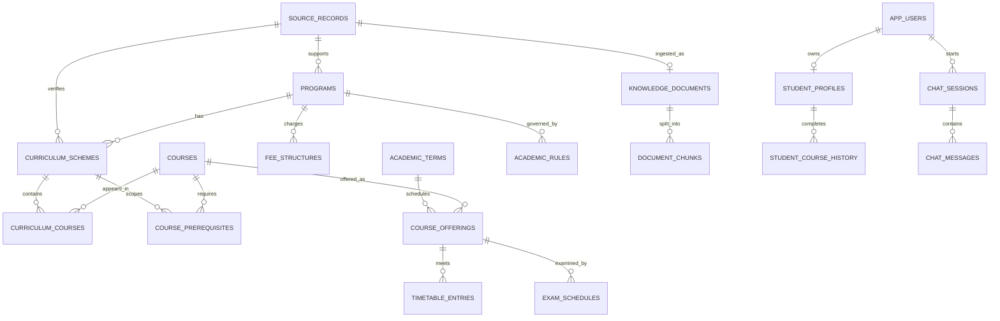

# Logical relationship map

```mermaid
erDiagram
    SOURCE_RECORDS ||--o{ PROGRAMS : supports
    SOURCE_RECORDS ||--o{ CURRICULUM_SCHEMES : verifies
    PROGRAMS ||--o{ CURRICULUM_SCHEMES : has
    CURRICULUM_SCHEMES ||--o{ CURRICULUM_COURSES : contains
    COURSES ||--o{ CURRICULUM_COURSES : appears_in
    CURRICULUM_SCHEMES ||--o{ COURSE_PREREQUISITES : scopes
    COURSES ||--o{ COURSE_PREREQUISITES : requires
    PROGRAMS ||--o{ FEE_STRUCTURES : charges
    ACADEMIC_TERMS ||--o{ COURSE_OFFERINGS : schedules
    COURSES ||--o{ COURSE_OFFERINGS : offered_as
    COURSE_OFFERINGS ||--o{ TIMETABLE_ENTRIES : meets
    COURSE_OFFERINGS ||--o{ EXAM_SCHEDULES : examined_by
    PROGRAMS ||--o{ ACADEMIC_RULES : governed_by
    SOURCE_RECORDS ||--o| KNOWLEDGE_DOCUMENTS : ingested_as
    KNOWLEDGE_DOCUMENTS ||--o{ DOCUMENT_CHUNKS : split_into
    APP_USERS ||--o| STUDENT_PROFILES : owns
    STUDENT_PROFILES ||--o{ STUDENT_COURSE_HISTORY : completes
    APP_USERS ||--o{ CHAT_SESSIONS : starts
    CHAT_SESSIONS ||--o{ CHAT_MESSAGES : contains
```

